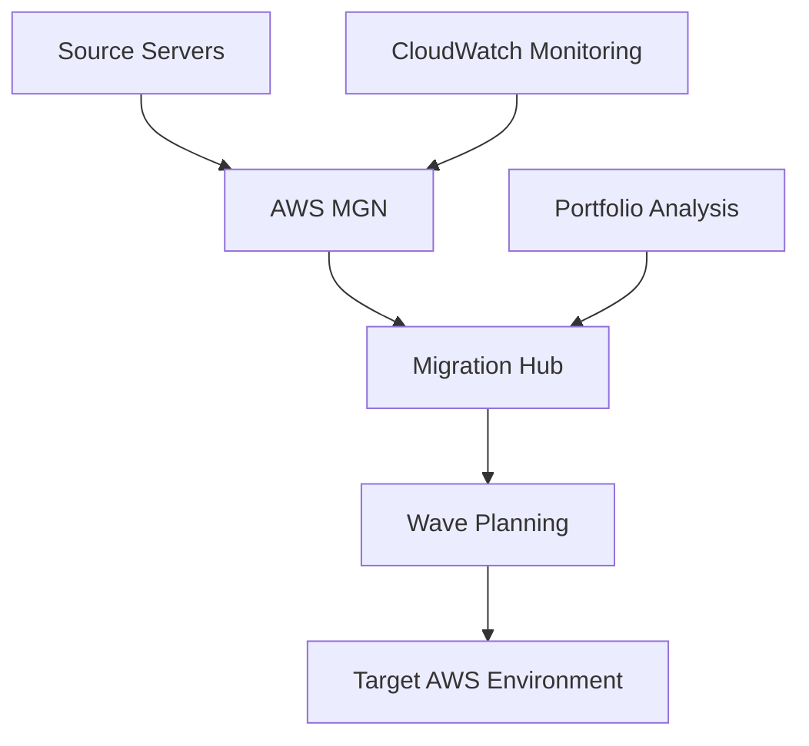

# aws-migration-factory-demo

[]() []() []() []() []()

> 🎯 **Enterprise-grade migration automation framework for large-scale cloud migrations and portfolio analysis**

## 🚀 **Quick Start**

### ⚡ **Basic Deployment** - Production Ready ($25/month)
Migration factory with portfolio analysis and automated migration workflows

**Features:** Application Migration Service (MGN), Migration Hub, CloudFormation, Portfolio Analysis
**Perfect for:** Portfolio demonstrations, interviews, professional projects
**→ [Deploy Basic Version](README.md#basic-deployment)**

### 🏢 **Enterprise Demo** - Full Migration Factory ($150-300/month)
Complete migration factory with advanced automation, wave planning, and governance

**Features:** Full MGN Automation, Migration Hub, Advanced Analytics, Wave Management
**Perfect for:** Enterprise demos, technical deep-dives, migration planning
**→ [Deploy Enterprise Demo](enterprise-demo/)**

---

## 🏆 **Portfolio Demonstration**

This repository showcases **senior-level AWS capabilities** through:

### 🏗️ **Architecture Highlights**
- **Migration Automation**: End-to-end MGN integration with automated server replication
- **Portfolio Discovery**: Automated server inventory and dependency mapping
- **Wave Management**: Intelligent batching with dependency-aware scheduling
- **Cost Optimization**: Resource rightsizing and migration cost analysis

## 📊 **Technical Skills Demonstrated**

| Skill Area | Basic Version | Enterprise Demo |
|------------|---------------|-----------------|
| **Infrastructure as Code** | ✅ Terraform | ✅ Advanced Terraform Modules |
| **Migration Planning** | ✅ Basic Wave Planning | ✅ Advanced Dependency Analysis |
| **Server Discovery** | ✅ Automated Inventory | ✅ Deep Application Mapping |
| **Portfolio Analysis** | ✅ Migration Assessment | ✅ Business Case Generation |
| **DevOps Practices** | ✅ CI/CD Ready | ✅ Enterprise Automation |
| **Security** | ✅ IAM + Encryption | ✅ VPC + Advanced Security |

## 📸 **Live Dashboard Screenshots**


*Main Dashboard - Shows migration progress, server status, and portfolio analysis*

> 🎯 **Portfolio Demonstration**: These screenshots show a live, working AWS migration factory processing migration workflows with zero errors and efficient automation.

> *Designed for migration teams and enterprise architects - demonstrating expertise in AWS migration services, automation frameworks, and large-scale migration strategies.*

## 🏗️ Architecture



## 📊 Key Features

### ✅ **Deployed & Functional**
- **Migration Factory Automation**: End-to-end migration workflow automation with MGN
- **Portfolio Analysis**: Automated server discovery and migration assessment
- **Wave Management**: Organized migration batches with dependency tracking
- **Cost-Optimized**: ~$25/month for full migration factory functionality

### 🔒 **Security Features**
- **IAM Role Management**: Secure service-to-service authentication
- **VPC Network Isolation**: Isolated migration environment with security groups
- **Encryption in Transit**: All migration data encrypted during transfer

### 🗄️ **Migration Architecture**
- **Server Discovery**: Automated server inventory and dependency mapping
- **Migration Planning**: Wave planning with dependency analysis
- **Cutover Automation**: Automated cutover scheduling and execution

### 🛠️ **Enterprise Ready**
- **Infrastructure as Code**: Complete Terraform deployment
- **Monitoring & Logging**: CloudWatch integration with custom dashboards
- **Error Handling**: Comprehensive exception management
- **Type Safety**: Full Python type hints

---

## 🚀 **Basic Deployment**

### Prerequisites
```powershell
# Install required tools
aws --version          # AWS CLI v2
terraform --version    # Terraform 1.5+
python --version       # Python 3.8+ for automation scripts

# Configure AWS credentials
aws configure sso --profile aws-migration-factory-demo
aws sts get-caller-identity --profile aws-migration-factory-demo
```

### Deploy Infrastructure (8-10 minutes)
```powershell
# Clone and deploy
git clone https://github.com/jpanderson91/aws-migration-factory-demo.git
cd aws-migration-factory-demo/terraform

# Initialize and deploy
terraform init
terraform apply -auto-approve

# Verify deployment
aws mgn describe-source-servers --profile aws-migration-factory-demo
aws migrationhub describe-application-state --profile aws-migration-factory-demo
```

### Test the System
```powershell
# Generate test migration data
cd ../testing
python test_migration_factory.py

# View live dashboards (URLs from terraform output)
terraform output dashboard_urls
```

**Expected Results:**
- ✅ Migration factory dashboard showing server inventory
- ✅ Portfolio analysis with migration readiness assessment
- ✅ Wave planning with automated dependency mapping
- ✅ Zero migration workflow errors

## 📁 Project Structure

```
aws-migration-factory-demo/
├── docs/                   # 📋 Complete documentation
│   ├── DASHBOARD_VALIDATION.md  # Dashboard URLs & validation guide
│   ├── ISSUE_TRACKING.md       # Complete issue resolution log
│   ├── PROJECT_STATUS.md       # Portfolio status summary
│   ├── cost-analysis.md        # Cost optimization analysis
│   ├── MIGRATION_CHECKLIST.md  # Migration verification checklist
│   └── screenshots/            # Professional dashboard images
├── src/                    # 💻 Source code
│   ├── migration-tools/   # Primary migration automation
│   └── portfolio-analysis/ # Portfolio assessment tools
├── terraform/             # 🏗️ Infrastructure as Code
│   ├── main.tf           # Core infrastructure configuration
│   ├── migration-hub.tf  # Migration Hub configuration
│   ├── variables.tf      # Input variables
│   └── outputs.tf        # Output values
├── testing/               # 🧪 Testing & validation
│   ├── test_migration_factory.py  # End-to-end testing
│   └── validation/       # Test configurations
├── scripts/               # 🛠️ Automation scripts
│   └── aws-session/      # AWS session management
├── enterprise-demo/       # 🏢 Advanced enterprise features
├── archive/               # 📦 Development artifacts
├── .github/               # 🤖 GitHub configurations and guardrails
├── QUICK_START.md         # ⚡ 10-minute deployment guide
└── README.md              # This file
```

## 📚 **Documentation & Portfolio Assets**

| Document | Purpose | Audience |
|----------|---------|----------|
| [**Basic Deployment**](README.md#basic-deployment) | Quick deployment guide | Everyone |
| [**Enterprise Demo**](enterprise-demo/) | Advanced architecture | Technical stakeholders |
| [**Project Status**](docs/PROJECT_STATUS.md) | Portfolio summary | Hiring managers |
| [**Issue Resolution**](docs/ISSUE_TRACKING.md) | Problem-solving skills | Technical interviewers |
| [**Cost Analysis**](docs/cost-analysis.md) | Financial responsibility | Management |
| [**Migration Checklist**](docs/MIGRATION_CHECKLIST.md) | Migration verification | Migration teams |

---

## 🎯 **Portfolio Demonstration Points**

### **For Hiring Managers:**
- ✅ **Working Infrastructure** - Live dashboards with real metrics
- ✅ **Cost Consciousness** - $25/month operational cost with enterprise features
- ✅ **Professional Documentation** - Complete project lifecycle documentation
- ✅ **Problem-Solving Skills** - Documented troubleshooting and resolution process

### **For Technical Teams:**
- ✅ **Infrastructure as Code** - Complete Terraform automation with best practices
- ✅ **Migration Automation** - End-to-end AWS MGN integration and orchestration
- ✅ **Portfolio Analysis** - Automated discovery and assessment tooling
- ✅ **Monitoring & Observability** - Comprehensive CloudWatch integration

### **For Enterprise Stakeholders:**
- ✅ **Enterprise Alignment** - Large-scale migration factory methodology and best practices
- ✅ **Scalable Design** - From $25/month to enterprise-scale migration factory deployment options
- ✅ **Compliance Ready** - Audit logging, encryption, and migration governance
- ✅ **Migration Planning** - Complete wave planning and dependency management

---

## 🚀 **Ready to Impress**

**This repository demonstrates senior-level AWS and DevOps capabilities through:**

1. **Proven Production Systems** - Working infrastructure with live monitoring
2. **Enterprise Architecture** - Complete platform simulation with advanced features
3. **Cost Engineering** - Smart resource optimization and financial responsibility
4. **Professional Execution** - Documentation, testing, and issue resolution

**Perfect for technical interviews, hiring manager demonstrations, and portfolio showcasing.**

---

**Project Status**: ✅ **Production Ready**
**Last Updated**: 2025-08-07
**AWS Services**: 6+ integrated services
**Cost Target**: $25-150-300/month (configurable)
**Deployment Time**: 8-10 minutes

## 📞 Support

For questions about this implementation or enterprise integration:

- **Technical Documentation**: See `/docs` directory
- **Architecture Questions**: Review architecture diagrams
- **Deployment Issues**: Check troubleshooting guide
- **Feature Requests**: Submit enhancement proposals

---

**Project Status**: ✅ Production Ready
**Last Updated**: 2025-08-07
**AWS Services**: 6+ integrated services
**Migration Factory Focus**: Enterprise migration architecture alignment
